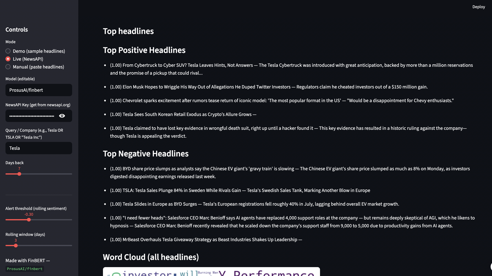

# Financial Sentiment Dashboard — FinBERT

📈 A web application built with Streamlit that analyzes financial news headlines for sentiment using the FinBERT model. The app provides insights into sentiment trends, distributions, and rolling averages for financial data.

## Features

- **Sentiment Analysis**: Analyze financial news headlines for positive, neutral, or negative sentiment.
- **Live News Fetching**: Fetch live news headlines from NewsAPI.org based on a query.
- **Sentiment Visualization**:
  - Sentiment distribution (positive, neutral, negative).
  - Rolling sentiment trends over time.
- **Word Cloud**: Generate a word cloud from analyzed headlines.
- **Customizable Settings**:
  - Choose rolling window size for sentiment analysis.
  - Set alert thresholds for rolling sentiment.
- **Modes**:
  - **Demo**: Analyze preloaded sample financial headlines.
  - **Live**: Fetch and analyze live news headlines using NewsAPI.
  - **Manual**: Paste custom headlines for analysis.

## Demo




## Installation

1. Clone the repository:

   ```bash
   git clone https://github.com/Chakshu061/sentiment-web-app.git
   cd sentiment-web-app
   ```

2. Install the required dependencies:

   ```bash
   pip install -r requirements.txt
   ```

3. Run the application:

   ```bash
   streamlit run app.py
   ```

4. Open the app in your browser at `http://localhost:8501`.

## File Structure

```
sentiment-web-app/
├── app.py                  # Main Streamlit app
├── requirements.txt        # Python dependencies
└── README.md               # Project documentation
```

## Usage

### Modes

1. **Demo Mode**:
   - Analyze preloaded financial headlines.
   - Click **Analyze Demo Headlines** to process the sample data.

2. **Live Mode**:
   - Enter your NewsAPI key and a query (e.g., "Tesla").
   - Fetch live news headlines and analyze their sentiment.

3. **Manual Mode**:
   - Paste custom headlines (one per line) into the text area.
   - Click **Analyze Pasted Headlines** to process the input.

### Results

- **Sentiment Results**: A table showing the sentiment, confidence score, and timestamp for each headline.
- **Rolling Sentiment Trends**: A time-series chart showing daily and rolling sentiment averages.
- **Word Cloud**: A visual representation of the most common words in the analyzed headlines.
- **Alerts**: Notifications based on rolling sentiment thresholds.

### Download Results

- Export the analyzed data as a CSV file for further analysis.

## Dependencies

- Python 3.7+
- Streamlit
- Transformers
- Pandas
- Plotly
- WordCloud
- Requests

Install all dependencies using the `requirements.txt` file:

```bash
pip install -r requirements.txt
```

## Example

### Input

#### Demo Headlines

```
Tesla shares jump after record quarterly deliveries
Apple warns iPhone production may be delayed due to supply chain issues
Amazon beats expectations as cloud revenue grows faster than predicted
Google faces antitrust scrutiny in the EU, shares fall
Microsoft invests $10B into new AI research center
Markets slide as inflation fears resurface
```

### Output

#### Sentiment Results

| Date       | Headline                                              | Sentiment | Score |
|------------|-------------------------------------------------------|-----------|-------|
| 2025-09-03 | Tesla shares jump after record quarterly deliveries   | Positive  | 0.98  |
| 2025-09-03 | Apple warns iPhone production may be delayed...       | Negative  | 0.92  |
| 2025-09-03 | Amazon beats expectations as cloud revenue grows...   | Positive  | 0.95  |

#### Visualizations

- **Sentiment Distribution**: Pie chart showing the proportion of positive, neutral, and negative headlines.
- **Rolling Sentiment Trends**: Line chart showing daily and rolling sentiment averages.
- **Word Cloud**: A word cloud generated from all analyzed headlines.

## License

This project is licensed under the MIT License. See the [LICENSE](LICENSE) file for details.

## Acknowledgments

- [Hugging Face Transformers](https://huggingface.co/transformers/) for the FinBERT model.
- [Streamlit](https://streamlit.io/) for the web app framework.
- [NewsAPI](https://newsapi.org/) for live news fetching.
- [Plotly](https://plotly.com/) for data visualization.

## Author

- [Chakshu Shaktawat](https://github.com/Chakshu061)
